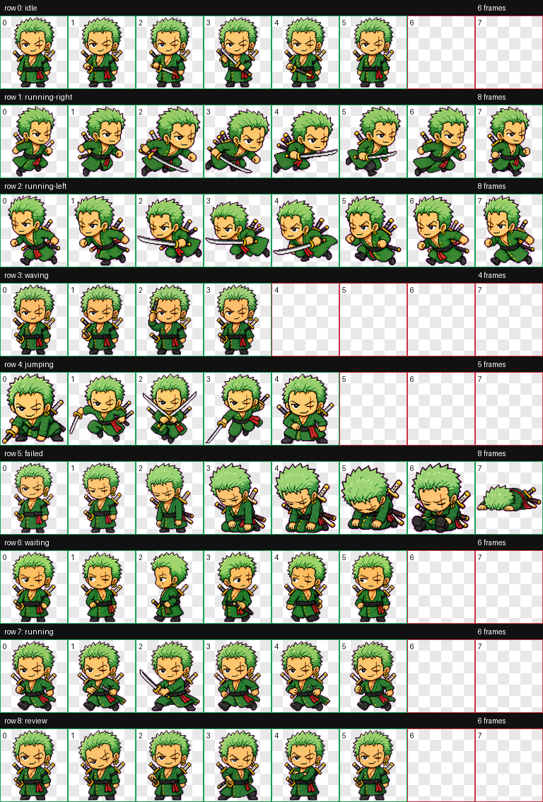

# Codex Pets

Custom pets for the Codex desktop app.

## Pets

### Zoro

A fan-made chibi swordsman pet for Codex, with sword idle, dash, jump-combo, lost-direction, review, and failed animations.



Included files:

- `pets/zoro/pet.json`
- `pets/zoro/spritesheet.webp`

## Easy Install

### Windows PowerShell

Run this in PowerShell:

```powershell
irm https://raw.githubusercontent.com/anisayari/codex-pets/main/install.ps1 | iex
```

### macOS / Linux

Run this in a terminal:

```bash
curl -fsSL https://raw.githubusercontent.com/anisayari/codex-pets/main/install.sh | bash
```

## Manual Install

1. Create this folder:

   - Windows: `%USERPROFILE%\.codex\pets\zoro`
   - macOS/Linux: `~/.codex/pets/zoro`

2. Copy these files into that folder:

   - `pets/zoro/pet.json`
   - `pets/zoro/spritesheet.webp`

3. In Codex, reload pets:

   - `Ctrl+K` -> `Force Reload Skills`
   - or restart Codex

4. Open `Settings` -> `Appearance` -> `Pets`, then select `Zoro`.

## Notes

- This is an unofficial fan-made pet.
- It is not affiliated with or endorsed by OpenAI, Codex, One Piece, Shueisha, Toei Animation, or Eiichiro Oda.
- The installer only writes to your local Codex pets folder.
